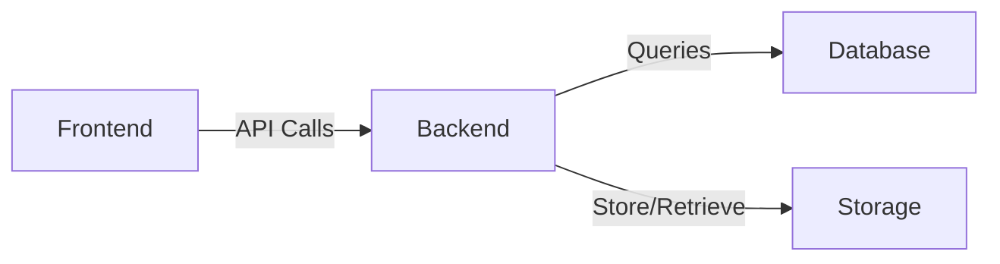

# Documentation

Comprehensive documentation for VitalTrack Technologies platform.

## Structure

```
docs/
├── api/
│   ├── overview.md
│   ├── authentication.md
│   ├── endpoints.md
│   ├── errors.md
│   ├── rate-limiting.md
│   └── examples.md
├── architecture/
│   ├── overview.md
│   ├── system-design.md
│   ├── data-models.md
│   ├── integrations.md
│   └── diagrams/
├── development/
│   ├── setup.md
│   ├── coding-standards.md
│   ├── testing.md
│   ├── debugging.md
│   └── common-tasks.md
├── operations/
│   ├── deployment.md
│   ├── monitoring.md
│   ├── maintenance.md
│   ├── disaster-recovery.md
│   ├── scaling.md
│   └── security.md
├── user-guide/
│   ├── getting-started.md
│   ├── inventory-management.md
│   ├── orders.md
│   ├── reporting.md
│   ├── settings.md
│   └── troubleshooting.md
├── contributing/
│   ├── code-review.md
│   ├── pull-requests.md
│   └── commit-guidelines.md
└── README.md
```

## Quick Links

### For Developers

- [Development Setup](development/setup.md)
- [API Documentation](api/overview.md)
- [Architecture Overview](architecture/overview.md)
- [Testing Guide](development/testing.md)
- [Coding Standards](development/coding-standards.md)

### For Operations

- [Deployment Guide](operations/deployment.md)
- [Monitoring & Alerting](operations/monitoring.md)
- [Disaster Recovery](operations/disaster-recovery.md)
- [Scaling Guide](operations/scaling.md)

### For Users

- [User Guide](user-guide/getting-started.md)
- [Inventory Management](user-guide/inventory-management.md)
- [Creating Orders](user-guide/orders.md)
- [Generating Reports](user-guide/reporting.md)

## Documentation Standards

### Markdown Format

- Use ATX-style headings (#, ##, ###)
- Code blocks with language specification
- Links to related documents
- Examples where applicable
- Clear structure and organization

### Code Examples

Include language specification and explanations:

```typescript
// Example TypeScript code
interface InventoryItem {
  id: string;
  name: string;
  quantity: number;
}

function updateInventory(item: InventoryItem): Promise<void> {
  // Implementation
}
```

### Diagrams

Use Mermaid for architecture and flow diagrams:



## Content Organization

### API Documentation

- Overview and authentication
- Available endpoints
- Request/response formats
- Error codes and handling
- Rate limiting information
- Code examples

### Architecture Documentation

- System components
- Data flow
- Design patterns
- Integration points
- Deployment architecture
- Scalability considerations

### Development Documentation

- Environment setup
- Project structure
- Coding standards
- Testing strategies
- Debugging techniques
- Common development tasks

### Operations Documentation

- Deployment procedures
- Monitoring setup
- Alert configuration
- Maintenance tasks
- Disaster recovery plans
- Security practices

## Writing Guidelines

### Clear and Concise

- Use simple, direct language
- Avoid jargon where possible
- Explain technical terms
- Keep paragraphs short

### Well-Organized

- Use hierarchical headings
- Include table of contents for long docs
- Use lists and tables
- Number steps in procedures

### Complete

- Include prerequisites
- Explain assumptions
- Show examples
- Provide troubleshooting

### Updated

- Track documentation version
- Note last update date
- Link to related docs
- Include deprecation notices

## Document Template

```markdown
# Document Title

**Status**: Active | Archived | Draft
**Last Updated**: 2026-06-25
**Version**: 1.0.0

## Overview

Brief description of what this document covers.

## Table of Contents

- [Section 1](#section-1)
- [Section 2](#section-2)

## Section 1

Detailed content...

## Section 2

Detailed content...

## Related Documents

- [Document 1](../path/to/doc1.md)
- [Document 2](../path/to/doc2.md)

## Frequently Asked Questions

**Q: Common question?**

A: Answer explanation.

---

**Maintainer**: Team Name  
**Last Review**: 2026-06-25
```

## Documentation Maintenance

### Regular Reviews

- Monthly: Check for outdated information
- Quarterly: Review structure and organization
- Yearly: Major revision and reorganization

### Update Checklist

- [ ] Update last modified date
- [ ] Verify all links work
- [ ] Check code examples run
- [ ] Update version numbers
- [ ] Review for clarity
- [ ] Test procedures

## Contributing Documentation

When adding documentation:

1. **Choose Location**: Place in appropriate category
2. **Use Template**: Follow documentation template
3. **Write Clearly**: Use guidelines above
4. **Include Examples**: Practical examples help
5. **Link Related Docs**: Help navigation
6. **Get Review**: Have peer review docs
7. **Keep Updated**: Maintenance plan

## Search

Documentation is searchable. Use meaningful headings and include keywords.

Common search terms:
- Architecture
- API
- Deployment
- Troubleshooting
- Authentication
- Database
- Performance

## Feedback

Documentation feedback is valuable:

- **Errors**: Incorrect or outdated information
- **Gaps**: Missing documentation
- **Clarity**: Confusing or unclear sections
- **Examples**: Additional examples needed

Submit feedback through:
- GitHub Issues (with `documentation` label)
- Pull requests with improvements
- Email: docs@vitaltrack.io

## Tools

Documentation uses:

- **Markdown**: Plain text format
- **Mermaid**: Diagrams and flowcharts
- **GitHub**: Storage and version control
- **MkDocs**: Static site generator (optional)

## Publication

Main documentation hosted at:
- **Internal**: GitHub repository
- **Public**: https://docs.vitaltrack.io

## Versioning

Documentation versions match software versions:

- v1.0.0 - Initial release documentation
- v1.1.0 - Updated for v1.1 features
- v2.0.0 - Major revision

Archive old versions with date suffix.

## Related Files

- [README.md](../README.md) - Project overview
- [CONTRIBUTING.md](../CONTRIBUTING.md) - Contribution guidelines
- [ROADMAP.md](../ROADMAP.md) - Product roadmap

---

**Last Updated**: 2026-06-25  
**Maintained By**: Documentation Team  
**Review Schedule**: Monthly
